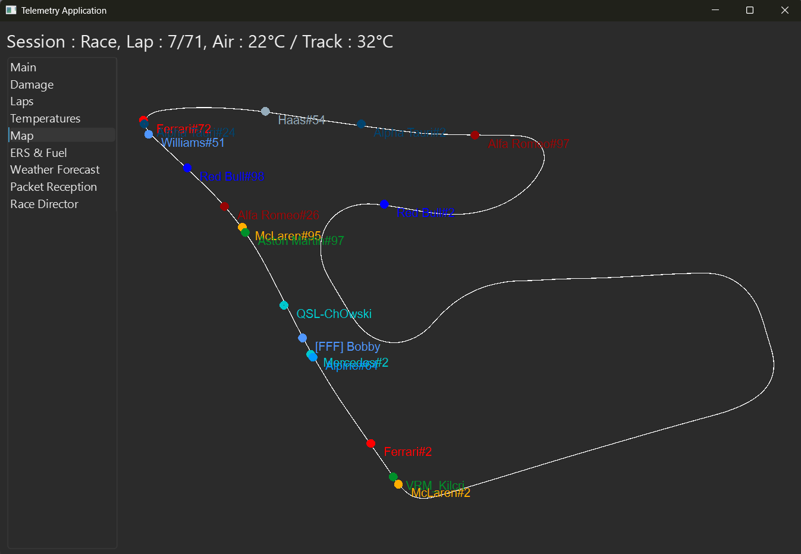
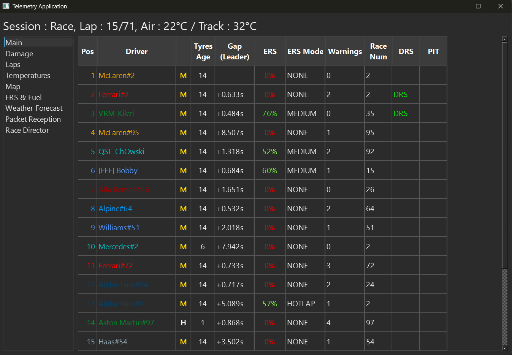
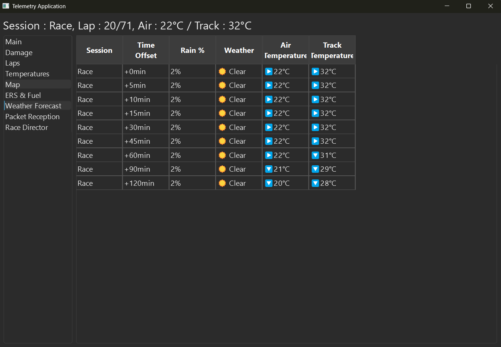

# F1 25 Telemetry Application (w/ PySide6)

## Table of Contents

- [Overview](#overview)
- [Features](#features)
- [Usage](#usage)
  - [Step 1: Run the application](#step1)
  - [Step 2: Send data to the application](#step2)
- [To-do List](#to-do-list)

## 🔍 Overview <a id="overview"></a>
The goal of this project is to make the most important data from the in-game EA F1 25 telemetry system easily accessible.







## 🚀 Features <a id="features"></a>
- ✅ Title bar displaying session type, laps (or time left if in qualifying), and race status (green, yellow, or red flag, SC, or VSC)
- ✅ Main Menu tab showing different information depending on the session type (Qualifying, Race, Time Trial)
- ✅ Fully functional mini-map displaying the track, car positions, and mini-sectors lighting up under a yellow flag
- ✅ Damage reports (excluding engine and gearbox) for all cars in the session
- ✅ Inner and outer tyre temperatures for all cars
- ✅ Current, best, and last lap times, along with sector times for all cars, depending on the session type
- ✅ ERS & Fuel management information as well as time penalties for all cars
- ✅ Weather forecast for upcoming sessions, including track and air temperature
- ✅ Compatibility with older parsers for previous EA F1 games (F1 22, F1 23, F1 24)


## 🔧 Usage <a id="usage"></a>
### <ins>Step 1 : Run the application</ins><a id="step1"></a>
1. Make sure all the required python packages are installed :

```bash
pip install PySide6
``` 
2. Run *Telemetry.py*

### <ins>Step 2 : Send datas to the application </ins> <a id="step2"></a>
Open the F1 Game :
- ➡️ Go to Settings, Telemetry Settings
- ➡️ Make sure the port in-game matches the port used by the application (20777 by default)
- ➡️ **If your game is connected to the same network as your computer running this application**, the easiest way is to enable the <u>UDP Broadcast</u> setting.
**If not**, you have to enter your public IP address in the <u>IP Address</u> setting.
- ✅ You are then good to go !


## ✏️ To-do list <a id="to-do-list"></a>
* Rajouter la vitesse au speed trap
* Fix the issue with weather Forecast Sample in 100% (Too many samples ?)
* Improve the overall appearance of the app (flag apparition, title)
* Track a bug where all not cars are shown in the minimap during full qualifying session
* Track a bug in full qualifying, session.nb_players might return 8 if 2 players retired instead of 10 anyway
* Improving map appearance
* Point not aligned with map (Belgium)

Telemetry issues :
* Check glitch on the grid where track_id is correctly set but marshals_zones are set to 0
Try 2024 version


